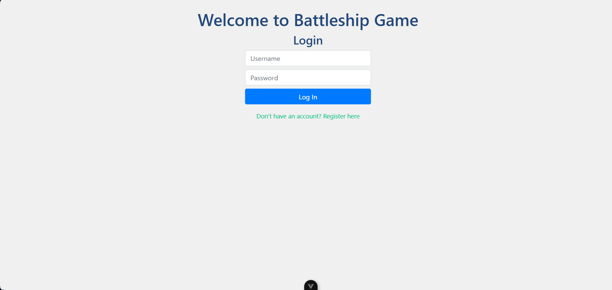
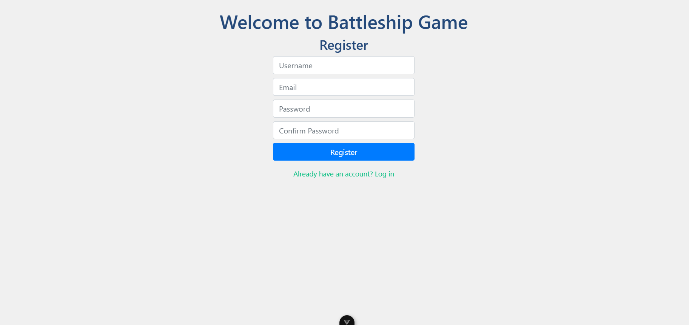
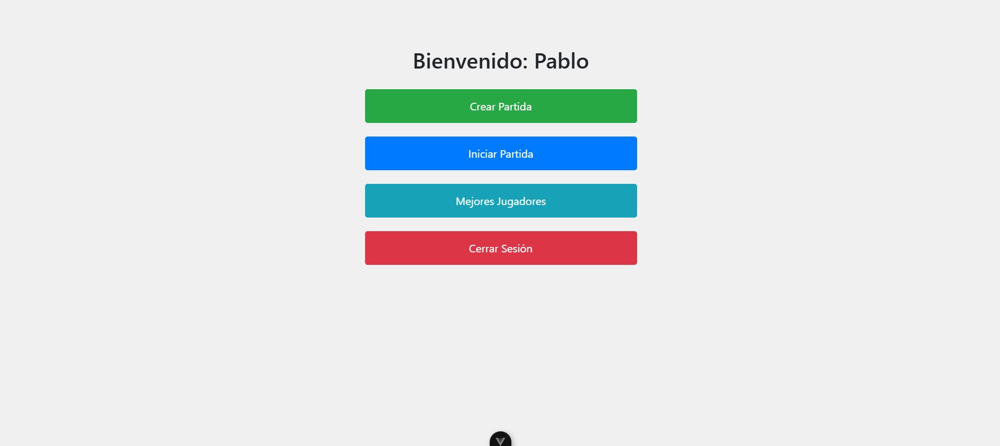
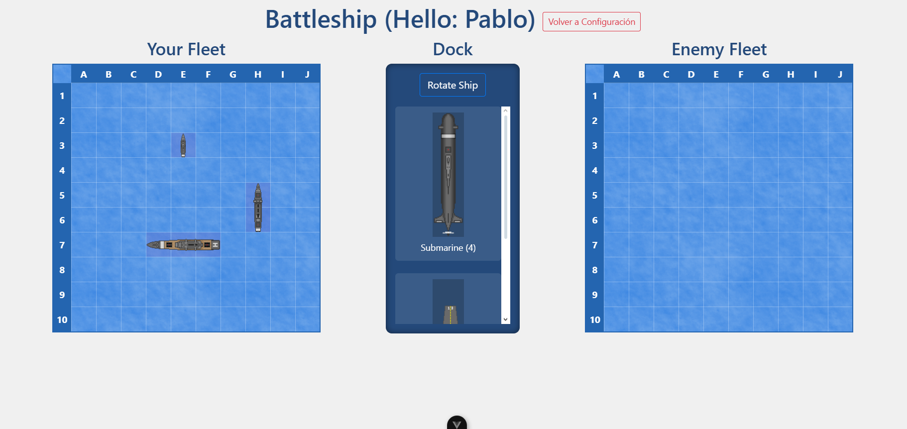
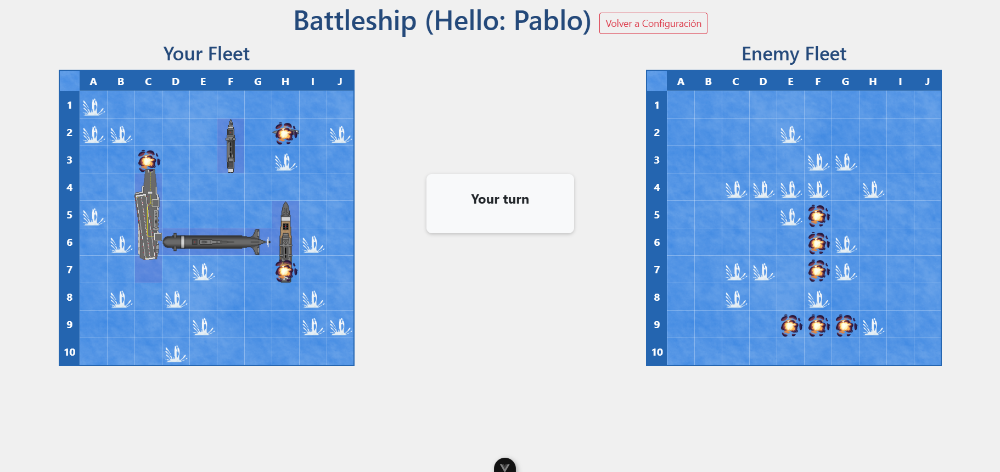
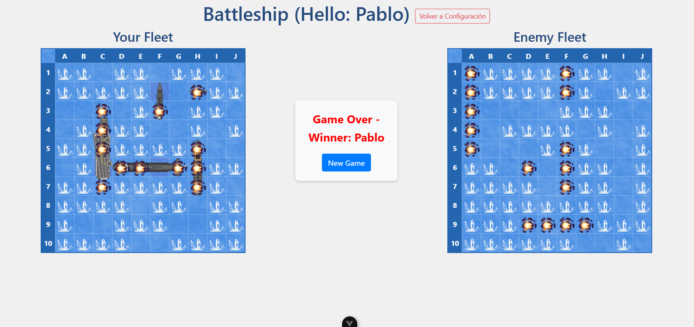
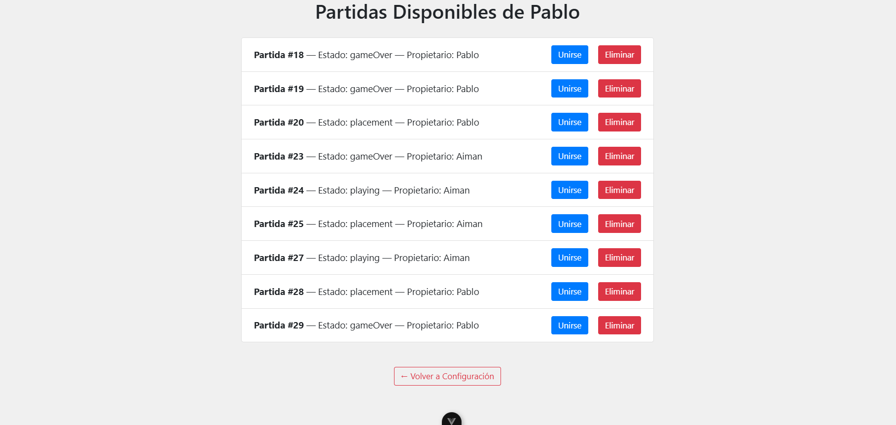
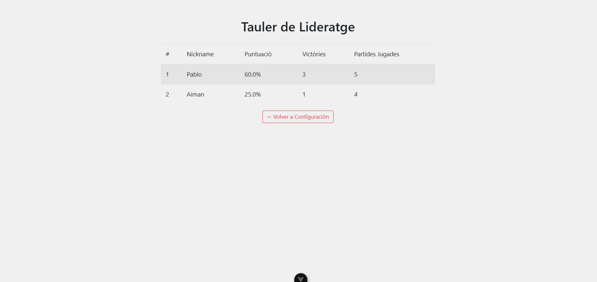

# About


| Equip | Membre 1            | Membre 2                  |
|-------|---------------------|---------------------------|
| C08   | M'ssali Doul, Aiman | Lira Casanova, Joan Josep | 


{{#authors AimanDoul04,Joanjo17}}

## 1. Objetivos cumplidos vs no cumplidos

**Objetivos cumplidos:**
- Registro y autenticación de usuarios.
- Creación de partidas (single-player contra bot).
- Posibilidad de colocar barcos y disparar en el tablero, respetando turnos y reglas (hit/miss).
- El juego finaliza correctamente con detección de ganador.
- Persistencia de partidas: reanudar y eliminar partidas guardadas.
- Manejo de múltiples partidas y jugadores simultáneos.
- Implementación de “Leaderboard” (Tauler de lideratge).

**Objetivos no cumplidos:**
- No se ha implementado el modo multijugador real.
- No se han creado pruebas unitarias ni de integración para el backend y frontend.

---

## 2. Resumen de la organización del equipo

Durante la pràctica, l’equip es va organitzar de la següent manera:

- **Joan Josep Lira Casanova**  
  - Implementació del backend.
  - Definició completa de models: `Player`, `Game`, `Board`, `Vessel`, `BoardVessel`, `Shot`.
  - Definició completa de vistes: `UserViewSet`, `PlayerViewSet`, `GameViewSet`, `BoardViewSet`, `BoardVesselViewSet`, `ShotViewSet`, `VesselViewSet`.
  - Definició completa de serializers: `UserSerializer`, `PlayerSerializer`, `GameSerializer`, `BoardSerializer`, `VesselSerializer`, `BoardVesselSerializer`, `ShotSerializer`.
  - Definició completa de URLs i nested routers per a cada vista.
  - Serialitzadors i ViewSets per a cadascun, incloent lògica de creació de partides, col·locació de vaixells, gestió de tirades i canvi de fase.  
  - Integració de Django Signals per a crear automàticament un `Player` quan es registra un `User`.  
  - Implementació de la lògica de comunicació amb l’API via `api.js`.
  - Tasques de la sessió 3, 4 i 5: adaptació de serializers, permisos i nested routers.

- **Aiman Doul**   
  - Creació y definició de models: `User`, `Player`, `Game`, `Board`, `BoardVessel`, `Shot`, `Vessel`.
  - Creació y definició de vistes: `UserViewSet`, `PlayerViewSet`, `GameViewSet`, `BoardViewSet`, `BoardVesselViewSet`, `ShotViewSet`, `VesselViewSet`.
  - Creació y definició de serializers: `UserSerializer`, `PlayerSerializer`, `GameSerializer`, `BoardSerializer`, `VesselSerializer`, `BoardVesselSerializer`, `ShotSerializer`.
  - Creació y definició completa de URLs i nested routers per a cada vista.
  - Desenvolupament del frontend.
  - Creació y modificació de components: `Home.vue` (login/registre), `Configuracion.vue` (menu principal), `Game.vue` (interficie de joc), `partidas_reanudar.vue` (llista de partides disponibles), `Leaderboard.vue` (tauler de lideratge).
  - Implementació de la lògica de comunicació amb l’API via `api.js`. 
  - Resolució d’errors en la rotació i col·locació de vaixells, així com en el flux “hit -> nou torn”.  
  - Sessió 2, tutorial sessió 3, 5 i 6: estructura i estils del frontend, correcció d’errors.

---

## 3. Descripción de las dificultades encontradas

- La lògica de torns (si un jugador fa “hit”, ha de continuar fins a fallar) va requerir bastants proves i ajustos tant al backend com al frontend.  
- La integració entre frontend i backend requeria validar esquemes JSON i gestionar errors (per exemple, col·locació fora de límits, tir repetit).  
- La persistència de l’estat (guardat al `localStorage`) i la recuperació al refresh no funcionava correctament fins que no es va afegir `getGameState(currentGameId)` a `onMounted`.  
- Gestionar múltiples partides simultànies implicava filtrar correctament per `game_id` i `player_id` als endpoints nested (nested routers).  
- A l’hora de rotar els vaixells i calcular `rf` i `cf` correctament: calia revisar `isVertical` i ajustos en `isValidPlacement`.  
- Falten proves unitàries i integració: la manca d’aquestes dificultava la localització d’errors petits i regressions,
per tant, feiem debug manual y inspecció de les peticions/respostes a l’API per assegurar-nos que tot funcionava com s’esperava.

---

## 6. Proves unitàries realitzades

    No s’han implementat proves unitàries específiques.
---

## 7. Proves creuades realitzades

**Ús dels fitxers `self_testing.md` i `beta_testing.md`**:  
  Hem documentat exhaustivament els errors menors i detallat totes les proves en aquests fitxers. 
Això ens ha permès detectar i corregir problemes petits de la interfície, ser més ambiciosos afegint funcionalitats noves 
(com el Leaderboard i la possibilitat d’eliminar partides) i garantir una experiència d’usuari més sòlida.

---

## 8. Capturas del funcionamiento final de la práctica

1. **Pantalla d’inici / login i registre**  
   
   

2. **Menú de configuració (Crear/Iniciar/Lideratge/Tancar Sessió)**  
   

3. **Col·locació de vaixells (fase “placement”)**  
   

4. **Interfície en fase “playing” (“Your Fleet” i “Enemy Fleet” ocult)**  
   

5. **La partida acaba amb “Game Over” i missatge de guanyador**  
   

6. **Llista de partides disponibles (Unir/Eliminar) en “Reanudar partida”**  
   

7. **Tauler de lideratge (5 millors jugadors amb % victòries)**  
   


---

## 9. Información de despliegue de la práctica

### Backend (Django)

1. Navega a la carpeta `backend/`.
2. Crear i activar entorn virtual:
   ```powershell
   poetry shell
    ```
3. Aplicar migracions:
    ```bash
    python manage.py migrate
    ```
4. Iniciar servidor de desenvolupament:
    ```bash
    python manage.py runserver
    ```

### Frontend (Vue.js)

1. Navega a la carpeta `frontend/`.

2. Copia i renombra el fitxer d’entorn
    ```bash
    cp env_sample .env
    ```
3. Instal·la dependències:
    ```bash
    npm install
    ```

4. Inicia servidor de desenvolupament:
    ```bash
    npm run dev
    ```